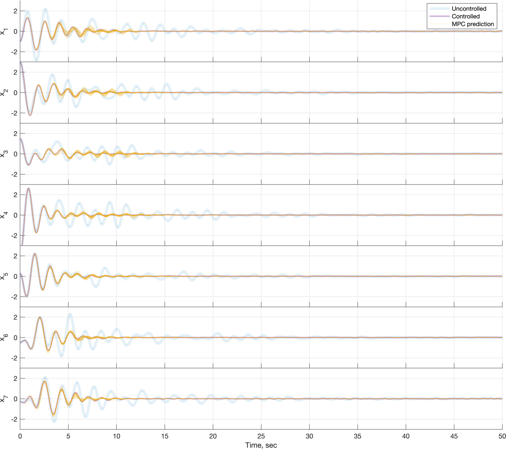

# Simple MPC for Spring-mass system

Simple Model Predictive Control (MPC) for non-linear spring-mass system.
The system is illustrated below, with `M` masses (`m_1`=`m_2`...`m_M`=`m`) connected by (non-linear) springs, and with velocity-dependent friction under each mass. The system is controlled by appling forces `u1` and `u2` to the first and last masses. Noise is applied to the control signals. Objective is to hold masses as close to their "0"s as possible, while applying as little control force as possible.

For linear springs, the force is `k*r`, where `r` is displacement. For non-linear springs, the force is `h(r) = k*r - 0.01 r^3`. Friction force is `2*c*v`, where `v` is velocity.

```
|   k     _______    k     _______         k     _______    k    |
|__/\/\__|       |__/\/\__|       |_ ... _/\/\__|       |__/\/\__|
|        |  m_1  |        |  m_2  |             |  m_M  |        |
|  u1 -->|_______|        |_______|             |_______|--> u2  |   x
============(c)==============(c)====== ... ========(c)================== -->
```

System dynamics is as following:

```
m*x_i'' + 2*c*x_i' + h(x_i - x_{i-1}) + h(x_i − x_{i+1}) = 0, for i=1..M,
```
where `x_i` is the position of mass `i`, `x_0 = x_{M+1} = 0`, `x_i'` and `x_i''` are first and second derivatives of `x_i`.

## Results

Figure below shows:
- uncontrolled simulation,
- closed-loop simulation,
- thin lines indicate positions predicted by MPC.



## Potential improvements

* **Make controller aware of spring non-linearity:** Linearize non-linear terms around the solution from the previous MPC iteration.

* **Consider more realistic noise:** Add noise to all elements. Something that would perhaps mimic gusts of wind, or temperature effects on spring and friction coefficients. Also, try giving "noisy" system parameters (`k`, `m`, `c`, `x`, `v`) to the MPC solver.

* **Add latency of MPC calculations** There should be a delay from the time MPC gets (x,v) and the time it outputs a solution.

* **Can we learn system parameters from observations?** Use optimal estimation, system identification, or machine learning to find system parameters (`k`, `m`, `c`) from observing uncontrolled/controlled system. Can also be done as reinforcement learning. Could also balance exploration-vs-exploitation, as opposed to only doing exploration.

## Dependencies
* [YALMIP](https://yalmip.github.io/)
* [tight_subplot](https://se.mathworks.com/matlabcentral/fileexchange/27991-tight_subplot-nh-nw-gap-marg_h-marg_w)
* [export_fig](https://github.com/altmany/export_fig)
* linprog ([Optimization toolbox](https://se.mathworks.com/products/optimization.html)) or any [YALMIP-supported](https://yalmip.github.io/allsolvers/), [LP](https://en.wikipedia.org/wiki/Linear_programming)-capable solver (some [QP](https://en.wikipedia.org/wiki/Quadratic_programming)/[SOCP](https://en.wikipedia.org/wiki/Second-order_cone_programming) solvers handle LP just fine).

## License
MIT.
